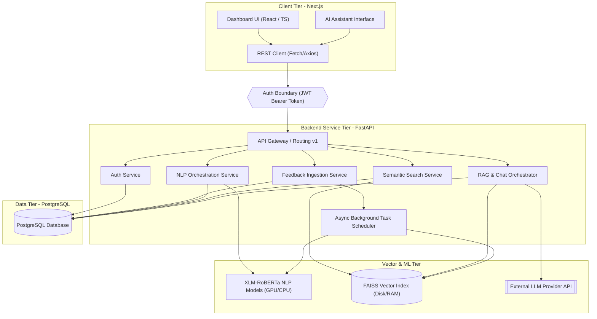

# System Architecture - VoxInsight

This document details the planned multi-tier system architecture for the VoxInsight platform. VoxInsight is designed with clear separation of concerns, strong boundaries between UI and business logic, and modular, swappable components.

---

## 1. Architectural Diagram

Below is the conceptual representation of the planned VoxInsight platform layers and information flow:

---

## 2. Core Architectural Components

### 2.1 Frontend Tier (PLANNED)
- **Framework**: Next.js (TypeScript) utilizing App Router.
- **Styling**: Tailwind CSS for high-quality, responsive layout design adhering to modern dark-mode and glassmorphic aesthetics.
- **Role**: Present visual analytical charts (using libraries like Recharts or Chart.js) and provide a conversational interface for RAG. It strictly acts as a consumer of backend JSON REST APIs, implementing zero native business or NLP computation.

### 2.2 Backend Tier (PLANNED)
- **Framework**: FastAPI (Python) running asynchronously.
- **Role**: Serve v1 REST endpoints, handle request validation, schema verification (Pydantic), and database object-relational mapping (SQLAlchemy).
- **Modularity**: Contains discrete service components (Auth, Ingestion, Analysis, Search, Chat) decoupling API routes from relational database interactions.

### 2.3 Database Tier (PLANNED)
- **Engine**: PostgreSQL.
- **Role**: Acts as the primary transactional storage for users, workspaces, metadata, feedback logs, and derived NLP structured results (e.g., sentiment categories, emotion tags, identified aspects, and alerts).
- **Design Principle**: High-dimensional embeddings are **not** persisted in PostgreSQL tables; instead, metadata references and IDs connect database records to the FAISS index.

### 2.4 NLP & Vector Tier (PLANNED)
- **Multilingual Backbone**: Custom fine-tuned or pipeline-wrapped XLM-RoBERTa models handling English, Hindi, and code-mixed Hinglish.
- **Vector Search Engine**: FAISS index mapping sentence-level or document-level feedback embeddings to integer offsets. This index is kept on disk/in memory and synchronized with the PostgreSQL database IDs.
- **External LLM Provider**: Pluggable LLM interface (supporting OpenAI GPT-4, Anthropic Claude, or Google Gemini) configured dynamically via backend environment variables for the conversational RAG layer.

---

## 3. Core System Data Pipeline

The data moves through the platform in a linear, structured pipeline:

1. **Data Sources**: Customers upload feedback datasets via CSV/JSON or submit them directly through integration endpoints.
2. **Data Ingestion**: FastAPI validates request payloads and files, creating feedback logs in PostgreSQL.
3. **Preprocessing**: The raw text undergoes language identification, normalization (transliteration handling for Hinglish text), and cleaning.
4. **NLP Analysis**: Preprocessed text is passed to XLM-RoBERTa classification heads to extract sentiment score, emotion class, aspect terms, aspect sentiments, and complaint status. Results are stored in PostgreSQL.
5. **Embedding Generation**: The normalized text is converted into dense vector embeddings.
6. **FAISS Vector Index**: The vector representation is written to the FAISS index, with the corresponding database ID indexed as metadata.
7. **Semantic Retrieval**: User search queries are embedded and run against the FAISS index to find Top-K semantically similar feedback.
8. **Retrieval-Augmented Generation (RAG)**: The retrieved database context is combined with a RAG template prompt.
9. **LLM Inference**: The pluggable LLM processes the contextual prompt to produce a grounded response.
10. **AI Assistant**: The grounded response and data citations are returned to the frontend.

---

## 4. Security & Integration Boundaries

### 4.1 Authentication Boundary
- Secured using stateless **JWT (JSON Web Tokens)** passed in the `Authorization: Bearer <TOKEN>` HTTP header.
- Cross-Origin Resource Sharing (CORS) is configured strictly on the backend to allow requests only from authenticated domains.
- Database access control is handled through role-based workspace permissions, preventing multi-tenant data leaks.

### 4.2 API Keys & Secrets
- No secrets, credentials, or API keys are hardcoded in the codebase.
- Environment variables (`.env`) load external LLM provider API keys, database connection strings, and JWT signing keys on startup.

---

## 5. Background Processing Strategy (PLANNED)

Since document ingestion, large NLP classification runs, and FAISS index rebuilds are computationally expensive, synchronous request-response loops will block.
- **Short term**: FastAPI `BackgroundTasks` will run low-latency asynchronous preprocessing.
- **Production phase**: A dedicated asynchronous task worker queue (e.g., Celery + Redis) will offload heavy model calculations and vector indexing from the primary web application threads.
