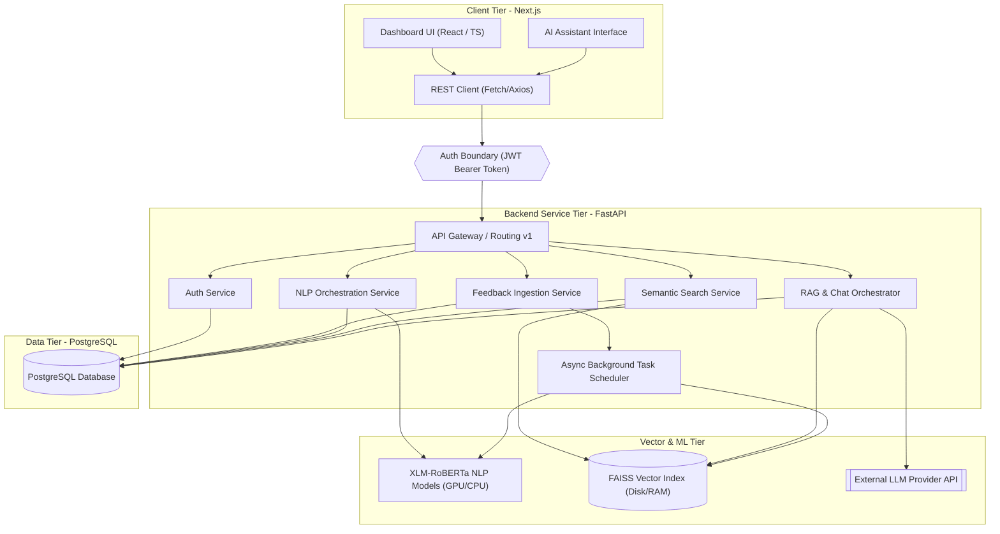

# System Architecture - VoxInsight

This document details the planned multi-tier system architecture for the VoxInsight platform. VoxInsight is designed with clear separation of concerns, strong boundaries between UI and business logic, and modular, swappable components.

---

## 1. Architectural Diagram

Below is the conceptual representation of the planned VoxInsight platform layers and information flow:



---

## 2. Core Architectural Components

### 2.1 Frontend Tier (PLANNED)
- **Framework**: Next.js (TypeScript) utilizing App Router.
- **Styling**: Tailwind CSS for high-quality, responsive layout design adhering to modern dark-mode and glassmorphic aesthetics.
- **Role**: Present visual analytical charts (using libraries like Recharts or Chart.js) and provide a conversational interface for RAG. It strictly acts as a consumer of backend JSON REST APIs, implementing zero native business or NLP computation.

### 2.2 Backend Tier (PLANNED)
- **Framework**: FastAPI (Python) running asynchronously.
- **Role**: Serve v1 REST endpoints, handle request validation, schema verification (Pydantic), and database object-relational mapping (SQLAlchemy).
- **Modularity**: Contains discrete service components (Auth, Ingestion, Analysis, Search, Chat) decoupling API routes from relational database interactions.

### 2.3 Database Tier (PLANNED)
- **Engine**: PostgreSQL.
- **Role**: Acts as the primary transactional storage for users, workspaces, metadata, feedback logs, and derived NLP structured results (e.g., sentiment categories, emotion tags, identified aspects, and alerts).
- **Design Principle**: High-dimensional embeddings are **not** persisted in PostgreSQL tables; instead, metadata references and IDs connect database records to the FAISS index.

### 2.4 NLP & Vector Tier (PLANNED)
- **Multilingual Backbone**: Custom fine-tuned or pipeline-wrapped XLM-RoBERTa models handling English, Hindi, and code-mixed Hinglish.
- **Vector Search Engine**: FAISS index mapping sentence-level or document-level feedback embeddings to integer offsets. This index is kept on disk/in memory and synchronized with the PostgreSQL database IDs.
- **External LLM Provider**: Pluggable LLM interface (supporting OpenAI GPT-4, Anthropic Claude, or Google Gemini) configured dynamically via backend environment variables for the conversational RAG layer.

---

## 3. Core System Data Pipeline

The data moves through the platform in a linear, structured pipeline:

1. **Data Sources**: Customers upload feedback datasets via CSV/JSON or submit them directly through integration endpoints.
2. **Data Ingestion**: FastAPI validates request payloads and files, creating feedback logs in PostgreSQL.
3. **Preprocessing**: The raw text undergoes language identification, normalization (transliteration handling for Hinglish text), and cleaning.
4. **NLP Analysis**: Preprocessed text is passed to XLM-RoBERTa classification heads to extract sentiment score, emotion class, aspect terms, aspect sentiments, and complaint status. Results are stored in PostgreSQL.
5. **Embedding Generation**: The normalized text is converted into dense vector embeddings.
6. **FAISS Vector Index**: The vector representation is written to the FAISS index, with the corresponding database ID indexed as metadata.
7. **Semantic Retrieval**: User search queries are embedded and run against the FAISS index to find Top-K semantically similar feedback.
8. **Retrieval-Augmented Generation (RAG)**: The retrieved database context is combined with a RAG template prompt.
9. **LLM Inference**: The pluggable LLM processes the contextual prompt to produce a grounded response.
10. **AI Assistant**: The grounded response and data citations are returned to the frontend.

---

## 4. Security & Integration Boundaries

### 4.1 Authentication Boundary
- Secured using stateless **JWT (JSON Web Tokens)** passed in the `Authorization: Bearer <TOKEN>` HTTP header.
- Cross-Origin Resource Sharing (CORS) is configured strictly on the backend to allow requests only from authenticated domains.
- Database access control is handled through role-based workspace permissions, preventing multi-tenant data leaks.

### 4.2 API Keys & Secrets
- No secrets, credentials, or API keys are hardcoded in the codebase.
- Environment variables (`.env`) load external LLM provider API keys, database connection strings, and JWT signing keys on startup.

---

## 5. Background Processing Strategy (PLANNED)

Since document ingestion, large NLP classification runs, and FAISS index rebuilds are computationally expensive, synchronous request-response loops will block.
- **Short term**: FastAPI `BackgroundTasks` will run low-latency asynchronous preprocessing.
- **Production phase**: A dedicated asynchronous task worker queue (e.g., Celery + Redis) will offload heavy model calculations and vector indexing from the primary web application threads.

---

## 6. Phase 4 retrieval implementation

The retrieval service uses `paraphrase-multilingual-MiniLM-L12-v2` through Sentence Transformers. It loads once on first use, encodes batches on CPU, and emits 384-dimensional unit vectors. FAISS `IndexFlatIP` operates on those vectors, so each returned inner-product score is cosine similarity.

Indexes live at `backend/data/faiss/<workspace UUID>/<dataset UUID>/index.faiss` with an adjacent `mapping.json`. Path components are generated only from validated database UUIDs. Search first checks membership, queries only completed index metadata for that workspace, then resolves candidate Feedback IDs back through a workspace-scoped PostgreSQL query. This makes database state authoritative and suppresses stale vectors after deletion. Phase 4 does not build prompts, call an LLM, or generate answers.

If persisted index files are missing or corrupt, the service marks their metadata `failed` and returns a controlled retrieval error rather than silently serving partial results.
## Phase 5 RAG layer

The RAG service is a backend-only orchestration layer over Phase 4 search. It authorizes conversations and datasets, builds bounded evidence context, calls the provider abstraction, and persists only normalized message/evidence records. The frontend consumes the conversations API and cannot access FAISS or provider credentials.

## Phase 6 Analytics Layer

The analytics layer provides business intelligence through SQL-based aggregation over structured NLP results. Unlike RAG, which uses LLMs and vector retrieval, analytics only queries persistent data via SQLAlchemy ORM aggregation functions (COUNT, SUM, AVG) on database tables, ensuring fast, repeatable, and auditable metrics.

### 6.1 Design Principles
- **SQL-Only Aggregation**: All calculations use database-level aggregation (func.count, func.avg, func.sum). No Python-level data manipulation or LLM calls.
- **Real Data, No Recomputation**: Metrics consume structured NLP results (Feedback, AnalysisResult, AspectAnalysis) already persisted during Phase 2–3.
- **Workspace Isolation**: All analytics endpoints enforce workspace membership verification before responding, preventing cross-workspace data leaks.
- **NULL Handling**: Percentage and rate calculations exclude NULL values from denominators. Coverage percentages represent (non-NULL count) / (total count).

### 6.2 Analytics Service Architecture
- **Module**: `backend/app/services/analytics.py` (~600 LOC)
- **Functions**:
  - `get_overview(db, user_id, workspace_id, dataset_id?)` — Returns 11 overview metrics.
  - `get_sentiment_analytics(db, user_id, workspace_id, dataset_id?, start_date?, end_date?)` — Sentiment distribution with percentages and confidence.
  - `get_aspect_analytics(db, user_id, workspace_id, dataset_id?, limit=20)` — Top aspects by frequency with per-aspect sentiment distribution.
  - `get_emotion_analytics(db, user_id, workspace_id, dataset_id?)` — Emotion distribution with coverage percentage.
  - `get_complaint_analytics(db, user_id, workspace_id, dataset_id?)` — Complaint classification metrics and rate.
  - `get_trends(db, user_id, workspace_id, dataset_id?, start_date?, end_date?, granularity="daily")` — Time-series sentiment trends with SQLite-compatible date grouping.
  - `get_dataset_comparison(db, user_id, workspace_id, dataset_ids?)` — Multi-dataset metric comparison.
  - `get_source_comparison(db, user_id, workspace_id, dataset_id?)` — Metrics grouped by feedback source.

### 6.3 Database Query Pattern
All analytics functions use SQLAlchemy `select()` with `where()` filters and `func.*` aggregation. Example:
```python
query = select(func.count(Feedback.id)).where(
    and_(
        Feedback.dataset_id == dataset.id,
        AnalysisResult.sentiment == "positive"
    )
)
result = session.scalar(query)
```

### 6.4 Frontend Integration
- **Dashboard Component**: `frontend/src/app/dashboard/page.tsx` displays KPI cards, sentiment/emotion charts, aspect rankings, trend tables, and complaint stats.
- **API Client**: `frontend/lib/api.ts` exports typed methods for all 8 analytics endpoints.
- **State Management**: React hooks manage dashboard state; all data flows from backend APIs.

### 6.5 Metrics Implemented
- **Overview**: Total feedback, analyzed count, pending/failed counts, analysis coverage, average rating, sentiment distribution, complaint distribution.
- **Sentiment**: Sentiment distribution (counts and percentages), average confidence per sentiment.
- **Aspects**: Aspect terms, mention frequency, per-aspect sentiment distribution.
- **Emotion**: Emotion distribution, percentages, coverage percentage.
- **Complaints**: Complaint true/false/unknown counts, complaint rate, coverage percentage.
- **Trends**: Daily/weekly/monthly sentiment distribution time series.
- **Comparisons**: Multi-dataset and multi-source metric aggregation.

