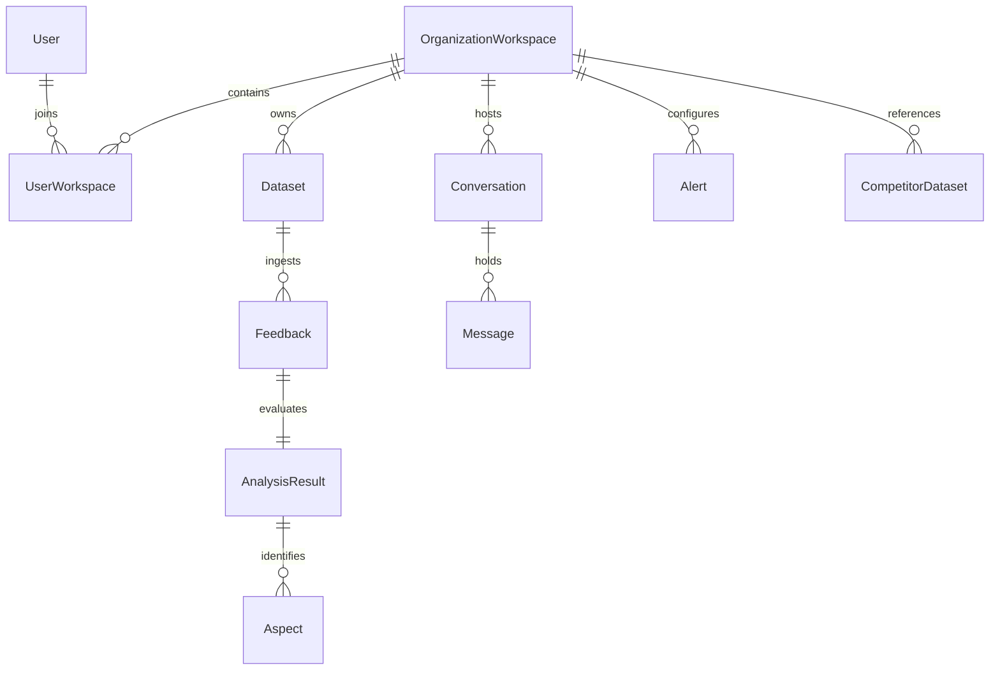

# Database Design & Schema - VoxInsight

This document details the planned PostgreSQL database structure for VoxInsight. This design captures our core relational entities, fields, constraints, and relationships.

> [!IMPORTANT]
> **Status**: Phase 1 implements the `users`, `workspaces`, `user_workspaces`, and `refresh_sessions` tables through SQLAlchemy models and Alembic migration `001_initial_auth_schema`. PostgreSQL is implemented/configured; runtime integration verification remains pending because Docker is unavailable in the current environment. The remaining tables are planned for later phases.

---

## 1. Relational Entity-Relationship Summary

The relational database uses PostgreSQL to capture multi-tenant workspace structures, dataset uploads, feedback data, granular analysis results (aspects, sentiment, emotion), RAG conversational histories, and alerts.

---

## 2. Planned Tables & Schema Draft

### 2.1 User
Tracks credentials, profile data, and timestamps for system users.

| Field | Type | Constraints | Description |
|---|---|---|---|
| `id` | UUID | Primary Key | Unique user identifier |
| `email` | VARCHAR(255) | Unique, Not Null | Account authentication email |
| `hashed_password` | VARCHAR(255) | Not Null | Hashed password credentials |
| `name` | VARCHAR(255) | Not Null | User's full display name |
| `created_at` | TIMESTAMP | Default NOW() | Account creation time |
| `updated_at` | TIMESTAMP | Default NOW() | Account modification time |

### 2.2 Organization / Workspace
Supports multi-user workspace separation for data isolation.

| Field | Type | Constraints | Description |
|---|---|---|---|
| `id` | UUID | Primary Key | Unique workspace identifier |
| `name` | VARCHAR(255) | Not Null | Workspace or Organization name |
| `owner_id` | UUID | Foreign Key (User.id) | Creator/Owner of workspace |
| `created_at` | TIMESTAMP | Default NOW() | Creation time |

### 2.3 UserWorkspace (Junction)
Maps relationships between users and workspaces (roles, access rights).

| Field | Type | Constraints | Description |
|---|---|---|---|
| `user_id` | UUID | FK (User.id), PK | Associated user ID |
| `workspace_id` | UUID | FK (Workspace.id), PK | Associated workspace ID |
| `role` | VARCHAR(50) | Not Null | Role inside workspace (e.g., admin, analyst) |

### 2.3a RefreshSession (Implemented in Phase 1)
Tracks server-side refresh-token sessions. Raw refresh tokens are never stored; a SHA-256 token hash is persisted instead.

| Field | Type | Constraints | Description |
|---|---|---|---|
| `id` | UUID | Primary Key | Session identifier |
| `user_id` | UUID | FK (User.id) | Session owner |
| `token_hash` | VARCHAR(255) | Indexed, Not Null | Hash of the raw refresh JWT |
| `expires_at` | TIMESTAMP | Not Null | Session expiration |
| `revoked_at` | TIMESTAMP | Nullable | Set on logout or refresh rotation |
| `created_at` | TIMESTAMP | Not Null | Session creation time |
| `last_used_at` | TIMESTAMP | Nullable | Most recent token rotation time |

### 2.4 Dataset
Tracks imported feedback collections.

| Field | Type | Constraints | Description |
|---|---|---|---|
| `id` | UUID | Primary Key | Unique dataset identifier |
| `workspace_id` | UUID | Foreign Key (Workspace.id) | Owner workspace |
| `name` | VARCHAR(255) | Not Null | User-defined dataset label |
| `description` | TEXT | Nullable | Brief explanation of dataset |
| `status` | VARCHAR(50) | Not Null | Processing status (e.g., pending, completed) |
| `created_at` | TIMESTAMP | Default NOW() | Creation time |

### 2.5 Feedback
Contains the individual raw customer feedback inputs.

| Field | Type | Constraints | Description |
|---|---|---|---|
| `id` | UUID | Primary Key | Unique feedback record identifier |
| `dataset_id` | UUID | Foreign Key (Dataset.id) | Source dataset reference |
| `raw_text` | TEXT | Not Null | Original text content submitted |
| `clean_text` | TEXT | Nullable | Post-normalized/transliterated text |
| `language` | VARCHAR(50) | Nullable | Identified language (e.g., en, hi, hinglish) |
| `created_at` | TIMESTAMP | Default NOW() | Submission time |

### 2.6 AnalysisResult
A 1-to-1 extension of Feedback capturing aggregated NLP model outputs.

| Field | Type | Constraints | Description |
|---|---|---|---|
| `id` | UUID | Primary Key | Unique analysis identifier |
| `feedback_id` | UUID | FK (Feedback.id), Unique | Reference to feedback |
| `primary_sentiment` | VARCHAR(50) | Not Null | Overall sentiment (positive, neutral, negative) |
| `overall_sentiment_score` | FLOAT | Not Null | Quantified sentiment value [-1.0 to 1.0] |
| `primary_emotion` | VARCHAR(50) | Not Null | Identified emotion (e.g., joy, anger, sadness) |
| `is_complaint` | BOOLEAN | Default FALSE | Classification flag for user complaint status |
| `created_at` | TIMESTAMP | Default NOW() | Evaluation timestamp |

### 2.7 Aspect
Aspect terms and specific sentiment values linked to a feedback record.

| Field | Type | Constraints | Description |
|---|---|---|---|
| `id` | UUID | Primary Key | Unique aspect entry ID |
| `analysis_result_id` | UUID | FK (AnalysisResult.id) | Parent analysis result reference |
| `term` | VARCHAR(255) | Not Null | Extracted noun/phrase aspect (e.g., "UI", "speed") |
| `sentiment` | VARCHAR(50) | Not Null | Specific sentiment toward this aspect |
| `confidence_score` | FLOAT | Not Null | NLP model classification confidence [0.0 to 1.0] |

### 2.8 Conversation
Stores user dialog session headers with the RAG business assistant.

| Field | Type | Constraints | Description |
|---|---|---|---|
| `id` | UUID | Primary Key | Unique chat session ID |
| `workspace_id` | UUID | Foreign Key (Workspace.id) | Parent workspace context |
| `user_id` | UUID | Foreign Key (User.id) | Active participant user |
| `title` | VARCHAR(255) | Not Null | Derived chat topic summary |
| `created_at` | TIMESTAMP | Default NOW() | Chat initiation time |

### 2.9 Message
Stores conversation messages, roles, and context tracking keys.

| Field | Type | Constraints | Description |
|---|---|---|---|
| `id` | UUID | Primary Key | Unique message identifier |
| `conversation_id` | UUID | FK (Conversation.id) | Parent session identifier |
| `sender_role` | VARCHAR(50) | Not Null | Role (user, assistant, system) |
| `content` | TEXT | Not Null | Message body |
| `retrieved_feedback_ids`| UUID[] | Nullable | Array of source Feedback IDs used as RAG context |
| `created_at` | TIMESTAMP | Default NOW() | Time of message |

### 2.10 Alert
Defines user criteria for trend triggering and incident notifications.

| Field | Type | Constraints | Description |
|---|---|---|---|
| `id` | UUID | Primary Key | Unique alert configuration ID |
| `workspace_id` | UUID | Foreign Key (Workspace.id) | Target workspace context |
| `name` | VARCHAR(255) | Not Null | Human-readable alert name |
| `criteria` | JSONB | Not Null | Metric thresholds (e.g., "negative Hinglish > 20%") |
| `is_active` | BOOLEAN | Default TRUE | Activation flag |
| `created_at` | TIMESTAMP | Default NOW() | Configuration creation time |

### 2.11 CompetitorDataset
Contains tracker records representing scraped or uploaded competitor feedback.

| Field | Type | Constraints | Description |
|---|---|---|---|
| `id` | UUID | Primary Key | Unique tracker ID |
| `workspace_id` | UUID | Foreign Key (Workspace.id) | Parent workspace context |
| `competitor_name` | VARCHAR(255) | Not Null | Competitor product/brand identifier |
| `raw_text` | TEXT | Not Null | Competitor review raw content |
| `sentiment` | VARCHAR(50) | Not Null | Derived sentiment value |
| `created_at` | TIMESTAMP | Default NOW() | Data ingest timestamp |

---

## 3. Embedding Storage Architecture

To maintain database performance and modularity, we do not store heavy embedding vectors inside PostgreSQL. Instead:
- When a `Feedback` record is ingested and preprocessed, its textual value is processed by the embedding pipeline, producing a high-dimensional vector.
- This vector is written directly to the **FAISS Vector Index**, mapping the vector's positional offset (e.g., row index `1409`) to the database UUID of the corresponding `Feedback` record.
- Vector retrieval returns a list of integer offsets, which are translated using an ID mapping catalog to query PostgreSQL for the associated `Feedback` and `AnalysisResult` data.
