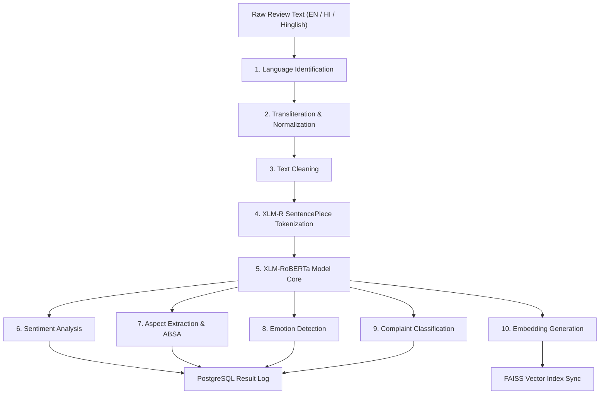

# Multilingual & Hinglish NLP Pipeline - VoxInsight

This document details the planned Natural Language Processing (NLP) pipeline for VoxInsight. The pipeline handles code-mixed customer feedback (English, Hindi, and Hinglish / English-Hindi mix) and outputs structured analytical tags.

> [!IMPORTANT]
> **Status**: PLANNED. All modules, models, tokenizers, and classification layers described here represent target NLP components. No pipeline execution code or AI dependencies are installed or configured in this phase.

---

## 1. Pipeline Overview

The pipeline processes raw, unstructured customer reviews through sequential stages to extract clean text representations, semantic vector embeddings, and classification results:

---

## 2. Detailed Pipeline Steps

### Step 1: Language Identification
- **Purpose**: Detect whether input feedback is written in standard English, Hindi (Devanagari script), or Romanized Hinglish (Hindi words written in Latin alphabets).
- **Target Approach**: A lightweight classifier (such as fastText or a custom language identification model) determines script types and token language densities to flag code-mixed texts.

### Step 2: Transliteration & Normalization
- **Purpose**: Map Hinglish text inputs to standardized representations.
- **Target Approach**: Romanized Hindi words can display spelling variations (e.g., "acha", "accha", "achha" for standard Hindi "अच्छा"). Normalization handles script mapping and standardizes Romanized representations of Hindi terms to preserve context.

### Step 3: Text Cleaning
- **Purpose**: Strip formatting, excessive whitespaces, HTML entities, and irrelevant punctuation. Emojis are parsed and preserved where possible, as they contain significant sentiment cues in customer feedback.

### Step 4: Tokenization
- **Purpose**: Split normalized characters into token IDs.
- **Target Approach**: Uses the SentencePiece tokenizer built into the `xlm-roberta-base` model. This subword tokenizer operates directly on raw strings without relying on language-specific segmenters, making it resilient to code-mixed spelling variations.

### Step 5: Model Backbone
- **Purpose**: Generate deep contextual representation vectors for inputs.
- **Target Model**: `XLM-RoBERTa` (XLM-R). This transformer-based multilingual backbone yields high-quality cross-lingual embeddings, enabling the system to map words with similar semantic meanings across scripts and languages into a unified vector space.

### Step 6: Sentiment Analysis (Sequence Classification)
- **Purpose**: Classify overall sentence sentiment into positive, neutral, or negative, along with a numeric sentiment score (from `-1.0` to `+1.0`).
- **Target Model Head**: A sequence classification head added to XLM-RoBERTa, trained on code-mixed sentiment datasets.

### Step 7: Aspect-Based Sentiment Analysis (ABSA)
- **Purpose**: Extract distinct feature aspects (e.g., "battery", "price", "delivery speed") and determine the sentiment specific to each aspect.
- **Target Approach**:
  - **Aspect Extraction**: Sequence labeling (Named Entity Recognition - NER layout) predicts span boundaries of aspect terms.
  - **Aspect Sentiment Classifier**: Classifies sentiment targeted toward the extracted aspect spans.

### Step 8: Emotion Detection
- **Purpose**: Segment feedback into core emotional categories (e.g., *anger, joy, sadness, fear, surprise*).
- **Target Model Head**: A multi-label classification head mapping text embeddings to predefined emotional classes.

### Step 9: Complaint Classification
- **Purpose**: Flag whether the customer feedback represents an actionable complaint/issue (e.g., service downtime, broken UI) or generic praise/discussion.
- **Target Model Head**: A binary sequence classification head outputting a boolean flag.

### Step 10: Trend & Clustering Analysis (Downstream Offline Process)
- **Purpose**: Cluster similar complaints and issues together over time to identify emerging user pain points automatically.
- **Target Approach**: Uses sentence embeddings to cluster feedback records using algorithms like HDBSCAN or K-Means, logging cluster labels in the database.
