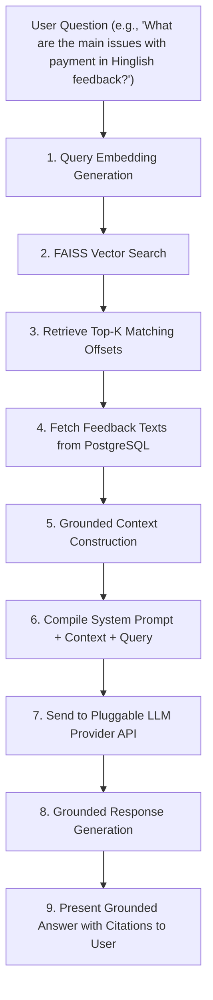

# Retrieval-Augmented Generation (RAG) Architecture - VoxInsight

This document details the planned Retrieval-Augmented Generation (RAG) workflow for the VoxInsight AI Business Assistant. The assistant retrieves relevant customer feedback records to provide grounded answers to user business queries.

> [!IMPORTANT]
> **Status**: PLANNED. The RAG architecture, vector search procedures, context schemas, and LLM orchestration methods are design blueprints. No functional code or external API configurations are active in this phase.

---

## 1. RAG Core Pipeline Flow

The AI Assistant processes queries by executing the following sequence of steps:



---

## 2. Pipeline Step Specifications

### Step 1: Query Embedding Generation
- **Action**: When a user inputs a query in the chat assistant, the backend processes the text string and generates a dense vector embedding.
- **Model**: Utilizes the same embedding model used to index feedback records, ensuring alignment in the shared vector space.

### Step 2: FAISS Vector Retrieval
- **Action**: Query the FAISS vector index with the generated query embedding.
- **Return Value**: FAISS returns the Top-K (e.g., 5-15) closest vector offsets and distance scores (cosine similarity or L2 distance).

### Step 3: Feedback Context Resolution
- **Action**: Map the retrieved vector offsets to primary keys (UUIDs) in the database.
- **PostgreSQL Query**: Query the database to retrieve the raw text, clean text, identified language, and derived analysis metrics (sentiment, aspect tags, emotion, and complaint labels) for those UUIDs.

### Step 4: Grounded Context Construction
- **Action**: Compile the retrieved database records into a clean, formatted text context blocks.
- **Format Example**:
  ```text
  ---
  Feedback ID: 25ad7c90-9511-4f11-9a74-d45a901844b2
  Text: "Payment gateway down tha, paise cut gaye validation page load nahi ho raha."
  Language: Hinglish
  Sentiment: Negative
  Aspects: Payment (Negative), Validation Page (Negative)
  ---
  ```

### Step 5: System Prompt and Guidelines Assembly
- **Action**: Create a prompt combining system instructions, retrieved context, and the user's question.
- **Prompt Guidelines**:
  - Enforce grounding constraints: "Answer the user's question using **only** the provided feedback context. If the answer is not supported by the context, state that you do not know. Do not invent facts."
  - Instruct the LLM to provide inline citations referencing the matching Feedback IDs (e.g., `[Feedback ID: 25ad7c90]`).

### Step 6: External LLM Call
- **Action**: Transmit the compiled prompt to the pluggable LLM provider (e.g., OpenAI, Anthropic, or Google Gemini APIs) using client SDKs.
- **Config**: Timeout limits and fallback systems are implemented to handle API rate limiting.

### Step 7: Grounded Response Generation
- **Action**: Receive the raw text output from the LLM, format citations, and stream the generated response to the frontend client. The system returns the generated markdown text alongside the array of source Feedback IDs used to construct the answer, allowing users to inspect the source customer reviews.
